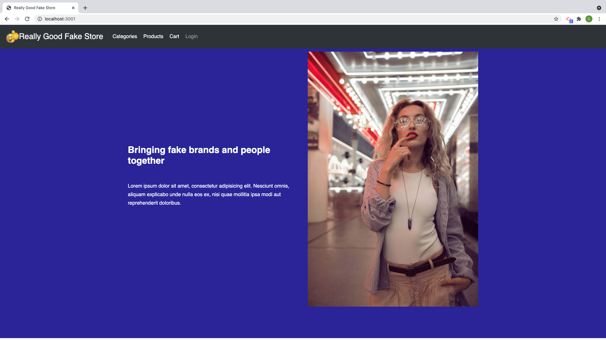
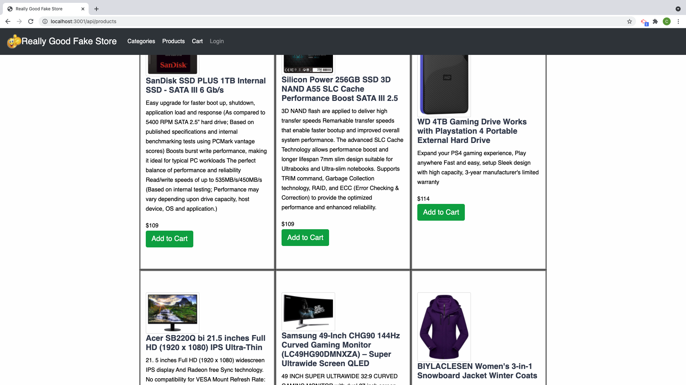
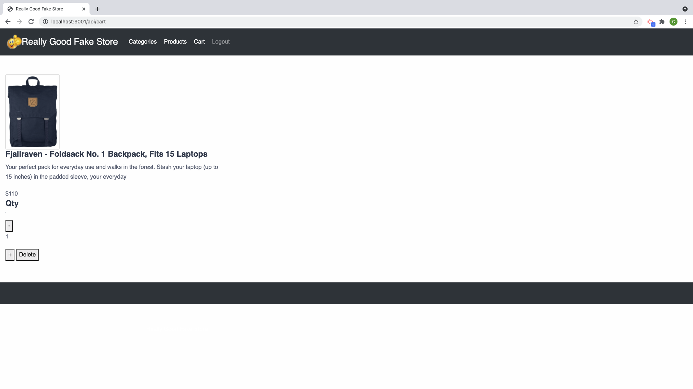

# Really Good Fake Store


## Description

This app is a mock e-commerce website. The user can view our product or view by category with creating a user account. The user must create an account to be able to add, delete or update qty in their cart. If the user logs out and and logs back in the items in the cart will remain for the user. 


  * [Installation](#install)
  * [Usage](#usage)
  * [Visit deployed Heroku app here](https://really-good-fake-store.herokuapp.com/)
  * [View presentation slides here](https://docs.google.com/presentation/d/16h9slhOimONXTGtBx6qNiJgWqWdzq8vWGRG21bLmR60/edit#slide=id.ge6e60ce203_0_52)

## User Story
As a user when shopping on this app I want to be able to view all products available. I also want to be able to look at prducts by category. When I find a product I want I want to be able to add it to a cart. Once in the cart I want to be able to delete it or add quantity. As a user I want to be able to log back into my account and continue shopping where I left off. 

## Concept/Motivation

Our project is a mock e-commerce store called Really Good Fake Store. E-commerce websites make up about 10% of the internet. Our goal was to be able to build this mock store with our current coding skills to mock something similar to what we might see on a real job. 

Future development for this project would be:
* Adding a wishlist function.
* Developing a check out function.
* Creating an algorithm that will show product recommends based off of items the user has looked at. 


## Install

Clone repository: 
- https://docs.github.com/en/repositories/creating-and-managing-repositories/cloning-a-repository

Install Dependencies: 
- All NPM packages required for this application are already listed as dependencies in the package.json file. Run the command 'npm i' command in your terminal at the root directory level to install the packages. 
```
npm i
```


## Usage

Once all the packages have been installed build your DataBase. You can use Mysql workbench to create your DB or run command line:
```
mysql -u root -p
```
and create your DB there. Once DB has been created run in your terminal:
```
npm run seed
```
to seed your DB. Once your DB is completed go to url:
```
http://localhost:3001
```


## Built With

- Handlebars express
- Bootstrap
- JavaScript
- MySQL
- Node.js
  - dotenv
  - express
  - express-sessions
  - bcrypt
  - mysql2
  - sequelize
  - validator

#### Creator Breakdown:

- Scrum Master: [Ana](https://github.com/abanae)
- Front End: [Max](https://github.com/maximosandoval)
- Back End: [Matt](https://github.com/COcoder555) & [Alicia](https://github.com/aliciachamar) & [Caitlin](https://github.com/CaitlinSwickard) & [Ana](https://github.com/abanae)


## Screen shots




